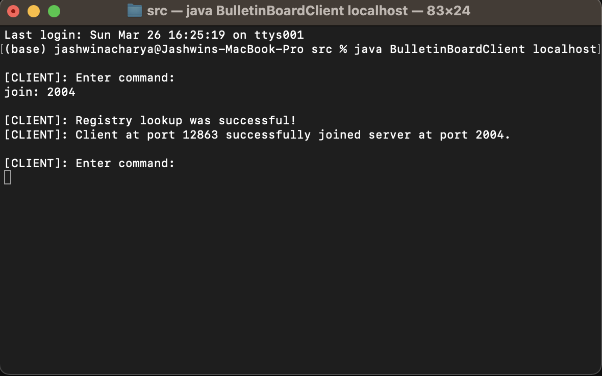
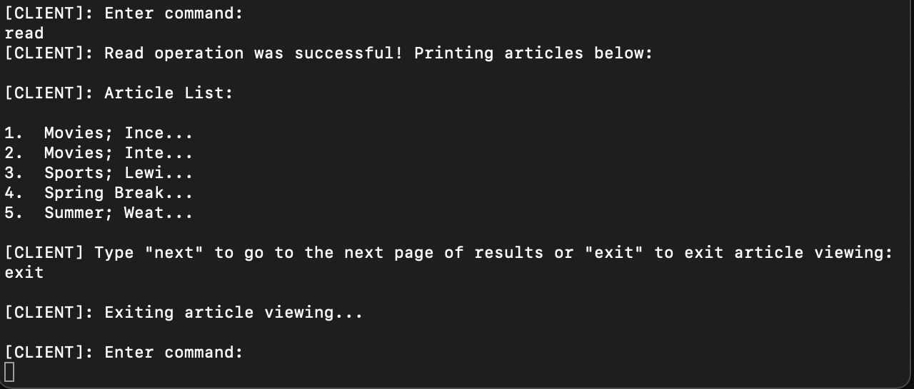
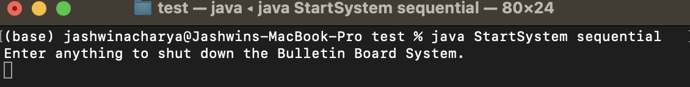

# Bulletin Board Server

Authors: Jashwin Acharya (`achar061`), William Stahl (`stahl186`)

Individual Contributions:

1. Jashwin Acharya:
<ul>
    <li> Jashwin Acharya
        <ul>
            <li> Implemented the complete client UI as well as client request validation functions. </li>
            <li> Implemented all client side unit tests </li>
            <li> Implemented Read-Your-Writes and Quorum consistency as well as the SYNCH operation in BulletinBoardServer.java </li>
        </ul>
    </li>
</ul>

2. Willaim Stahl:

## Compile all code

Navigate to the `src` directory.

```
cd src
```

Then run our compilation script.

```
./compile_and_copy.sh
```

## Running servers

Navigate to src folder.

Open one terminal window in this folder and start one server using the command: `java BulletinBoardServer <hostname> 2004 <consistency name>`

Example for running the coordinator using 3 different consistencies:

```
java BulletinBoardServer localhost 2004 sequential
```

```
java BulletinBoardServer localhost 2004 readyourwrites
```

```
java BulletinBoardServer localhost 2004 quorum
```

Example image below:


Similarly you can use commands `java BulletinBoardServer localhost 2000 readyourwrites`, `java BulletinBoardServer localhost 2000 sequential`, `java BulletinBoardServer localhost 2000 quorum` etc for launching other servers. You can replace 2000 with other valid ports such as 2001, 2002 and 2003 to launch 4 replicas and have the coordinator running on port 2004. Make sure to run the coordinator first before running the other servers as the other servers require the coordinator to be running already. Also all replicas should follow the same consistency pattern. If the replicas' consistency pattern differs from that of the coordinator, then the replicas will automatically shut down and will have to be restarted.

Alternatively, run `java StartSystem` (from the testing section) in the test directory, which automatically starts 5 servers at ports 2000-2004.

## Running clients and using client UI

Navigate to the "src" folder if not already in it.

```
cd src
```

Open another terminal window and run the client using the command: `java BulletinBoardClient <hostname>`

Example for running one client (same command can be used to launch multiple clients in separate terminal windows)

```
java BulletinBoardClient localhost
```

Example image below:


# Joining Servers

Before you perform a post, reply, read or choose command, you have to join the server(s) first. Let's assume we have the coordinator server running at port 2004. When prompted to enter a command, type `join: <port_number>` for example to join a server running on port 2000. Note: The "join" command is NOT case sensitive.

```
join: 2004
```

Example image below of a successful "join" command request:



The port number used above can be 2000, 2001, 2002, 2003 and 2004 and you can open extra terminals to join the other servers using any of the valid port numbers.

Example image below:


If you type any port other than the ones specified above, then you will be prompted to enter another request with a valid port number.

Example image below of a join error:


You cannot join a server again if you are already part of it.

Example image below of joining a server and then attempting to join it again:


# Leaving Servers

You can leave servers at anytime using the `leave: <port_number>` command.

```
leave: 2004
```

Example image below of a successful "leave" command request:


Client's cannot leave from servers that they aren't a part off. Attempting to do so will cause the program to prompt the user to enter another command.

Example image below of a leave error:


Clients can connect and disconnect from any LIVE server at any point in time. However, attempting to join or leave a server that hasn't been started yet can cause the program to prompt the user to enter another command.

Example of a leave error for when the server itself isn't online:


You will notice the same error message displayed if you attempt to join a server that is NOT online.

# Posting articles

Once you have joined any of the 5 live servers, you can begin posting, replying, reading and choosing articles.

Every "Post" command has the following format: `Post: <Article Title>;<Article Contents>`.

Example "post" command below (not case sensitive):

```
post: Movies; Inception is awesome!
```

Example image of entering a valid Post command after clicking "ENTER":


The format above is strict. Entering any other format will proceed to display an error in the client terminal and the article will not be published on the Bulletin Board server(s).

Example image of an invalid Post command:


# Reading articles

The `read` command (not case sensitive) displays the current list of articles on the bulletin board.

Example image below:


The `read` command only displays 5 articles at once and cuts them short if they are longer than 16 characters. If client(s) have posted more than 5 articles on the bulletin board, then the `read` command allows you to access the "Page viewing" functionality where you can type `next` to read the next page of articles, or `exit` to exit page viewing.

Example image below of the "Page Viewing" function:


Example image below of typing `next` and hitting "ENTER":


Example image below of typing `exit` and hitting "ENTER":



# Replying to articles

The `read` command above displays article IDs along with the article title and contents. The `reply <Article ID>;<Article Title>;<ArticleContents>` command allows you to reply to specific article IDs that exist on the bulletin board server(s).

Example of a valid `reply` command (not case sensitive):


Attempting to reply with an incorrect ID will result in an error and the reply will not be posted to the server and the client will be prompted to enter another request.

Example image of a `reply` command that leads to an error:


Attempting to reply to a valid ID but with an invalid article format will also result in an error and the reply will not be posted to the server.

Example image of a valid `reply` command but with an invalid article format:


# Choosing articles

The `read` command above displays article IDs along with the article title and contents. The `choose: <Article ID>` command can be used to display the article title and contents associated with an article ID.

Example of a valid `choose` command (not case sensitive):


If the article ID being requested does not exist, then an error message is printed in the client terminal and the user will be prompted to enter other commands.

Example image below of an invalid `choose` command:


## Running Client Side Tests

Navigate to `test` folder with `cd test` from root.

Open a terminal window in the `test` folder.

Run the command below to execute the Client Side tests:

```
java -cp ./../lib/junit-4.13.2.jar:./../lib/hamcrest-core-1.3.jar:. RunClientTestCases
```

Example image of the output when the above command is run:


## Running the Server tests

NOTE: Make sure no other terminal windows are open in the `src` directory where any of the servers are running. Please make sure to close those terminal windows if they are open before executing the below tests, since it can cause the below tests to fail.

Navigate to `test` folder with `cd test` from root.
Run each compiled program with the same consistency (in different terminals):

```
java StartSystem <sequential|quorum|readyourwrites>
java -cp ./../lib/junit-4.13.2.jar:./../lib/hamcrest-core-1.3.jar:. RunTestClass <sequential|quorum|readyourwrites>
```

Example commands for sequential consistency:

```
java StartSystem sequential
```

```
java -cp ./../lib/junit-4.13.2.jar:./../lib/hamcrest-core-1.3.jar:. RunTestClass sequential
```

Example image below of starting the system using Sequential Consistency:



Example image and output of running the tests with sequential consistency:


You can press `ENTER` in the terminal window where you ran the `java StartSystem sequential` system command to terminate the process.

Once the sequential consistency tests are run, close the terminal windows where you executed the above 2 commands and then relaunch two new terminal windows in the same `test` folder to run the Read-Your-Writes tests. This is an important step, so please don't miss this.

Example commands for read-your-writes consistency:

```
java StartSystem readyourwrites
```

```
java -cp ./../lib/junit-4.13.2.jar:./../lib/hamcrest-core-1.3.jar:. RunTestClass readyourwrites
```

Example image below of starting the system using Read-Your-Writes Consistency:


Example image and output of running the tests with Read-Your-Writes consistency:


You can press `ENTER` in the terminal window where you ran the `java StartSystem readyourwrites` system command to terminate the process.

Once the read-your-writes consistency tests are run, close the terminal windows where you executed the above 2 commands and then relaunch two new terminal windows in the same `test` folder to run the Quorum tests. This is an important step, so please don't miss this.

Example commands for quorum consistency:

```
java StartSystem quorum
```

```
java -cp ./../lib/junit-4.13.2.jar:./../lib/hamcrest-core-1.3.jar:. RunTestClass quorum
```

Example image below of starting the system using Quorum Consistency:


Example image and output of running the tests with Quorum consistency:


You can press `ENTER` in the terminal window where you ran the `java StartSystem Quorum` system command to terminate the process.

IMPORTANT NOTE: There is a slight degree of randomness associated with our server tests for the "quorum" consistency which we were not able to find the root cause for. If the quorum tests do fail, then please close all terminals and relaunch two fresh terminal windows in the `test` directory and run the above 2 commands (`java StartSystem sequential` and `java -cp ./../lib/junit-4.13.2.jar:./../lib/hamcrest-core-1.3.jar:. RunTestClass sequential`) again to run the tests. We weren't encountering any issues during manual testing, but our unit tests sometimes fail for quorum consistency. Again, this is a slightly random thing that happens and the tests are expected to run and execute correctly 95% of the time. Tests may also occasionally fail due to connection errors (`java.net.ConnectException: Connection refused`) If this happens, please run them again after restarting `StartSystem`.

## Design Doc

### Assumptions/Decisions/Limitations

In order to guarantee read-your-writes consistency, we wait to return to the client until its write request has propagated through the Bulletin Board System.

### Components

#### BulletinBoardServer

An instance of this class is a remote object on which the client invokes remote methods from `BulletinBoardServerInterface`. A running instance of one of these is one of the servers in the Bulletin Board system. It also implements `ServerToServerInterface`, which defines some methods that servers can use in communication with one another. Some inter-server communication is actually from `BulletinBoardServerInterface` since there were issues when implementing them as in `ServerToServerInterface`.

For our project, we decided to keep the number of servers at 5 since we did not want to burden system resources by having more than 5 servers continuously communicating with one another as well as with multiple clients. Each server internally can also have a max number of 5 clients join them at once for similar aforementioned reasons. One limitation here is that there is no way for our server to know if a client has died as the Server interfaces we have defined only return values. Thus if a client goes offline before leaving a server, then the server will not be able to update its list of currently joined clients and there could be offline client objects taking up space in the list. A simple fix for this is to simply relaunch all the active servers. All 5 servers are assigned fixed ports (valid ports are 2000, 2001, 2002, 2003 and 2004) and the central server by default always runs on the local host on port 2004.

We have also added a "Timer" class variable on line 441 in BulletinBoardServer.java that allows our other 4 servers (or replicas) to continuously ping the coordinator to ensure that it is live and running. Once the coordinate server is offline, then the other replicas automatically disconnect too since we don't have a leader election algorithm in place to assign central server duties to another server. Another reason for having the other replicas shut down when the coordinator dies is that the coordinator is the central point of contact for all our consistency strategies, which we go into more detail later in this document. We decided to invoke this Timer function every 1 second to ensure that the server's are always aware when the coordinator is down since we are continuously exchanging information between servers.

We have an additional "Timer" variable defined at line 460 in BulletinBoardServer.java that repeatedly calls our "Synch" function every 2 seconds to ensure that all servers are updated with the latest bulletin board information by fetching data from the server that contains the most recent article ID. Whenever a replica goes offline while communicating with a client and comes back online later, it is initally updated with the bulletin board server information that the coordinator holds and our "Synch" function makes sure the replica is updated again with the most latest information in-case the coordinator doesn't have the latest bulletin board information. The "Synch" function also keeps track of a list of available servers and removes server objects that are offline to ensure that we don't end up trying to Ping a server whose object is not available. We decided on a 2 second repeat time interval to ensure that the server list is regularly updated with live server objects to not cause issues later on when servers start to communicate with one another.

#### ConsistencyStrategy

This is an interface through which the strategy pattern is implemented, allowing `BulletinBoardServer` to instantiate an object that implements the interface according to the desired consistency. `SequentialStrategy`, `QuorumStrategy`, and `ReadYourWritesStrategy` are the classes that implement this interface. Some of these class methods take the server object as an argument so that they can manipulate the server and use it for communication according to the actual consistency. It's in these classes where much of the inter-server communication takes place.

#### ReferencedTree

This is where the actual content of the bulletin board is stored. Each node of the tree is an article, and the tree structure makes for easy tracking of replies and replies to replies. An `ArrayList` also maintains direct references to each node in order to avoid searching the tree for a specific article ID (indexed by ID).

#### Sequential Strategy Implementation

In our implementation for Sequential Strategy, we have defined three functions:

ServerPublish: This function is invoked from the client side when they want to Post a new article to the bulletin board or reply to an existing one. The client queries any random server from a list of servers and the server in-turn contacts the coordinator to publish the client's request (whether it is to Post or Reply). We maintain a variable called "replyTo" which stores the article ID that we want to reply to. If the article ID the user wants to reply to is 0, then we consider it a new article that should be posted on the bulletin board. If the article ID is not 0, then we consider it to be a reply to an existing article on the bulletin board. Once the coordinator has updated its central copy of the bulletin board, it RMIs the other replicas to ensure they have the up-to-date bulletin board information. If any one of the replicas is offline at the time of update, then it will be updated with the latest bulletin board information once it joins back in (as detailed earlier in the BulletinBoardServer section earlier). Also, we can have anywhere between 1-5 servers live for sequential consistency. There is no requirement that all 5 servers should be live. As long as the coordinator is live, Sequential Consistency can be performed.

ServerRead: This function simply retrieves all the articles currently posted on the bulletin board using the tree structure we have defined in the ReferencedTree class.

ServeChoose: This function returns an article of the client's choosing using its ID. If the article is not found, an appropriate error message is printed in the server and client terminal(s).

#### Read-Your-Writes Implementation

In our implementation for the Read-Your-Writes Strategy, we have defined three functions:

ServerPublish: Similar to Sequential Consistency, this function is invoked when the client wants to Post or Reply to an article. Once again, the client queries a random server (not necessarily the coordinator) and the server retrieves the primary copy of the bulletin board from the coordinator, which we assume contains all the latest bulletin board information. The server locally makes its updates and then queries the other replicas to update their respective copy of the bulletin board to ensure everyone has the latest copy, so that if a client disconnects from the first server and rejoins another server, it is guaranteed to still be able to read that article. The "replyTo" parameter serves the same function as in the SequentialStrategy class. The "Synch" function defined in BulletinBoardServer.java ensures that if any server joins later, then it will be updated with the latest bulletin board server information. One thing to note here is that if the coordinator is unable to update its primary copy, then the update is not propagated to the other replicas. As per our design, this situation can only arise if the coordinator server goes offline, and even if it goes offline, then the other replicas automatically shutdown too (explanation for this is provided in the BulletinBoardServer section above). Similar to sequential consistency, as long as the coordinator is live, the client can keep communicating with it. There is no requirement that all 5 servers have to be live at once.

ServerRead: This function simply retrieves all the articles currently posted on the bulletin board using the tree structure we have defined in the ReferencedTree class.

ServeChoose: This function returns an article of the client's choosing using its ID. If the article is not found, an appropriate error message is printed in the server and client terminal(s).

#### Quorum Implementation

In our implementation for the Quorum Strategy, we have defined three functions:

ServerPublish: Similar to Sequential and Read-Your-Writes consistency, this function posts or replies to an article on the bulletin board. The client contacts any random server and this server contacts our coordinator to initialize the random Read and Write quorums. We have variables defined for the Read and Write quorums called NR and NW respectively and the valid pairs of values for our system are (3,3), (2,4) and (1,5) where the first value corresponds to NR and second corresponds to NW. We decided that since we only have 5 servers in our system, it is important for each member of the write and read quorums to agree on their respective operations. We also mandate that all 5 servers should be online in order to partake in Quorum Consistency. Once all members of the write quorum have updated their respective bulletin boards, we update our read quorum servers using the server that overlaps between both quorums as this server contains the updated version of the bulletin board. There is however one limitation of our implementation: Suppose we have 3 servers in our write quorum and one of the servers goes down. The write operation would be successful, but only on 2 servers. The update would not be propagated to the read quorum servers as its possible that it was the overlapped server that went down. Any subsequent Read or Post/Reply operations would result in failure as the system will contain only 4 live servers and 1 offline server. Even if the "Synch" function defined in BulletinBoardServer updates the list of the latest servers, we don't form our read and write quorums until the client sends a Post or Reply request. In order to combat this, we can relaunch the server that went offline earlier and perform a Post/Reply operation from the client side. This will allow the read and write quorums to get reset and they will now all contain fresh live server objects. Also, the "Synch" operation guarantees that all servers remain up-to-date, so once the offline server joins back in, it will have the latest version of the data and the read quorum servers will also have been updated with the latest bulletin board information. It's also possible for any of the read quorum servers to go down while they are being updated and we can combat that by once again just relaunching the server and allowing the "Synch" function to update the offline server.

ServerRead: This function allows the overlapped server between both read and write replicas to update the other read quorum servers with the latest information. We mandate that all members of the read quorum have to return the exact same value of the article to ensure that we always have the latest copy of the bulletin board articles for the client.

ServeChoose: The code for this function is very similar to the ServerRead function. Every server in the read quorum searches through their reference trees for their individual copy of the article whose ID is being requested, and return the article if all their read results match.

#### BulletinBoardClient

This class defines the UI for the client to make Join, Leave, Post, Reply, Read and Choose messages to the server. We maintain a list of the servers that the client is a part of and update it everytime we perform any of the aforementioned operations to ensure that any offline server objects are removed from the list. Unlike project 1, we decided to only ping servers when the client performs a Post, Reply, Read and Choose request. We noticed that if we did it repeatedly and tried to update the server list (called "joinedServers" in the file), then we would occasionally run into errors and conflicting changes to the list. Hence we decided to only Ping servers and update the server list only when its necessary.

If the client tries to join or leave any offline servers, then the appropriate error message is printed in the client terminal. There is no restriction as to what servers the client can join. They can connect, disconnect and reconnect with any server of their choosing. We have also defined various validation functions that validate join, leave, post, reply, read and choose commands that the client enters in the terminal. We decided to keep our Article format as "Article Title;Article Contents" as it is easy to understand and simple to use. We have included a "Page viewing" functionality defined in a function called HandleResultView that prints 5 articles at a time and provides the user with the option to continue browsing through pages of articles or exit from page viewing and return to sending requests to the server(s).

We have included various print statements that highlight any possible failures such as attempting to join/leave servers that are offline or attempting to reply to or read or choose articles that don't exist. We have also included print statements for acknowledging server responses in case the server failed or was successful in posting articles, replies, returning list of articles, or returning an article of the clients choosing.

### Analysis

For the analysis, we chose to do a theoratical measure of each consistency based on the number of messages sent, from the client's request to the server's official response. We include registry queries (locating, looking up). The number of messages passed assumes the worst case (client did not contact coordinator) where the server responded after successfully completing a non-trivial request.


Writes for any consistency require many messages to be passed. One reason for so many messages is that a loop that contacts the other 4 servers sends 3 messages inside the loop: one for registry location, one for registry lookup, and one for the actual RMI. Our quorum implementation manages to eliminate some of these as it maintains some references to replicas between method calls. By the time we realized how this could reduce message passing, our implementations were essentially complete.

Quorum consistency, as expected, suffers in the number of reads. The other two strategies simply contact one replica and get its result, but quorum consistency must contact multiple replicas.


For quorum consistency, the number of messages sent for a read or write is a linear function of `Nr` or `Nw` respectively. Reads outperform writes since reads use existing references to replicas. If we removed the in-loop registry operations, writes would cost significanty less and be more similar to reads:


## Testing Description

One test class exists for each consistency. Each of these classes has a test for basic operations between a client and one server. Expected output is tested for

1. Read() with published content
2. Choose() for nonexistant ID
3. Reply() to a nonexistant ID
4. Post()
5. (1), (2), and (3) where the items exist
6. Expected format for all the above

Each of these classes also each has a test where a client switches which server it interacts with multiple times. In the sequential test, some articles are posted, and a client checks that they are in the same order of reading across multiple servers. The quorum test posts some articles and ensures they can be read from all servers. Lastly, the read-your-writes test ends up very similar to the quorum tests in that, as a client, it writes to a server and checks that it can read those writes from other servers.

The client command line validation functions are thoroughly tested as well in `ClientTestCases.java' for checking for missing or invalid article formats as well as making sure whitespaces are not an issue when parsing client requests. Details are below:

1. 3 test cases for checking valid post commands
2. 8 test cases for checking invalid post commands
3. 4 test cases for checking valid reply commands
4. 6 test cases for checking invalid reply commands
5. 2 test cases for checking valid choose commands
6. 3 test cases for checking invalid choose commands
7. 4 test cases for checking valid Join or Leave requests
8. 6 test cases for checking invalid Join or Leave requests
