# Project 3: Simple xFS

## Authors: Jashwin Acharya (`achar061`), William Stahl (`stahl186`)

## Running Server and clients

Navigate to the src folder.

Open one terminal window in this folder and compile Tracker.java using the following command:

```
javac Tracker.java
```

You can start the server using the following command:

```
java Tracker
```

Example image below:

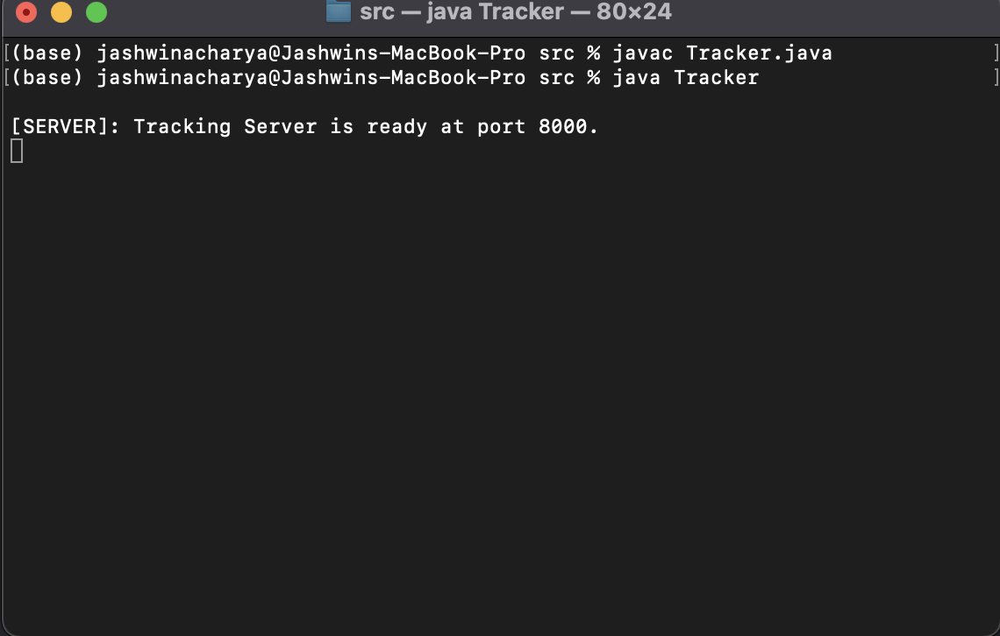

## Running clients and using client UI

Open a separate terminal window (apart from the server one) and compile PeerNode.java using the command:

```
javac PeerNode.java
```

In the same terminal window, use the following command:

```
java PeerNode localhost 0
```

Example image below:

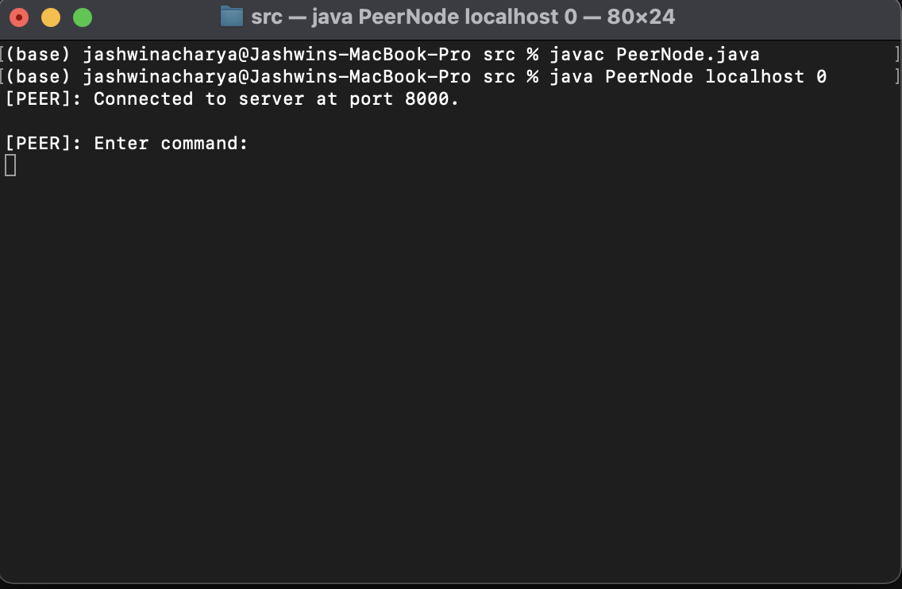

The above command has the format `java PeerNode <server host name> <machID>`. You can only assign a value of 0, 1, 2, 3 or 4 to the machID. Any other machID produces an error and you will have to run the command again using a valid machID.

Example image below of using an incorrect machID:

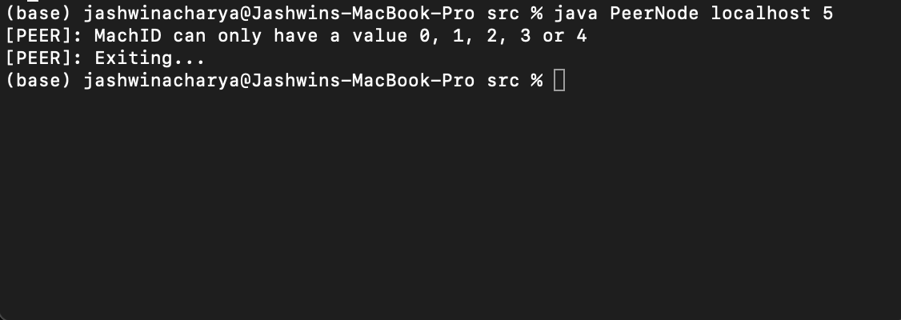

### Joining the tracker server

The peers automatically join the tracking server when they are first launched, but in the event that the server goes down and the client wants to join again, they can simply enter `join` in the client UI.

Example image below:

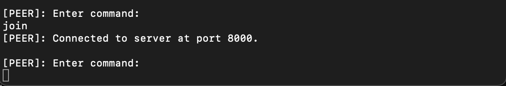

A peer cannot join the tracker server if it's already part of it.

Example image below:

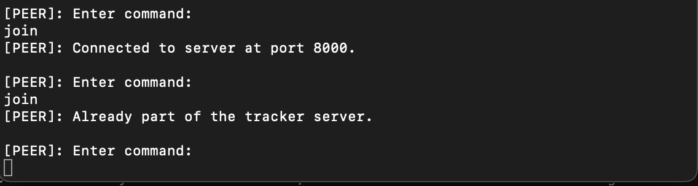

Every peer needs to have a different machID before attempting to join the server. Launching two peers with the same machID causes the peer that was launched at a later time to exit gracefully.

Example image below:

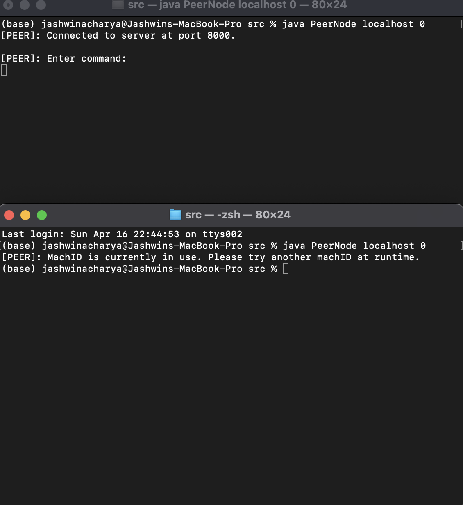

### Leaving the tracker server

A peer can leave the tracker server at any time by entering `leave` in their respective peer UI terminal.

Example image below:


A peer cannot leave the tracker server if it was never part of it.

Example image below:

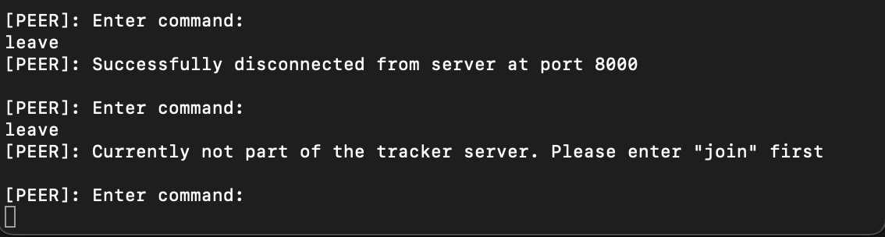

### Finding a file

In order to find a file, a peer can enter the `find: <file name>` in their respective UI terminal. Case doesn't matter for the `find` command, so you can enter `FIND: <file name>` and that should work too.

Example image of a successful `find` command:

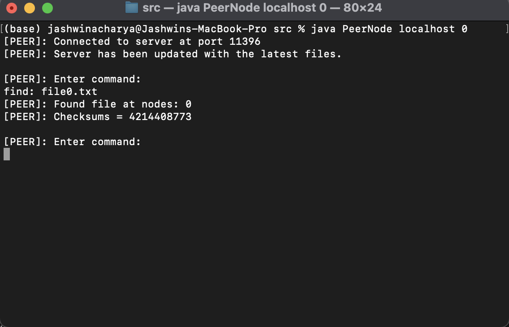

Attempting to find a file that doesn't belong to any peer results in an error message being printed.

Example image of an unsuccessful `find` command:

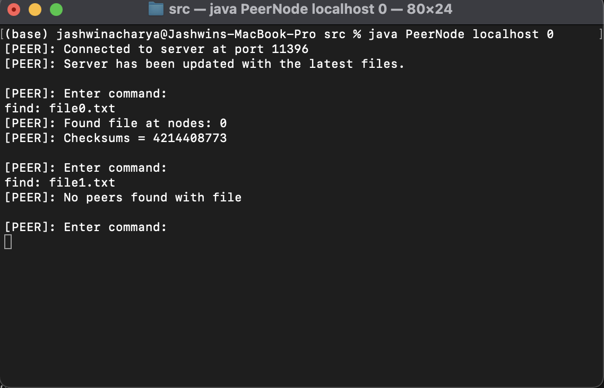

The format of the `find` function matters.

Example image of an incorrectly formatted `find` function:

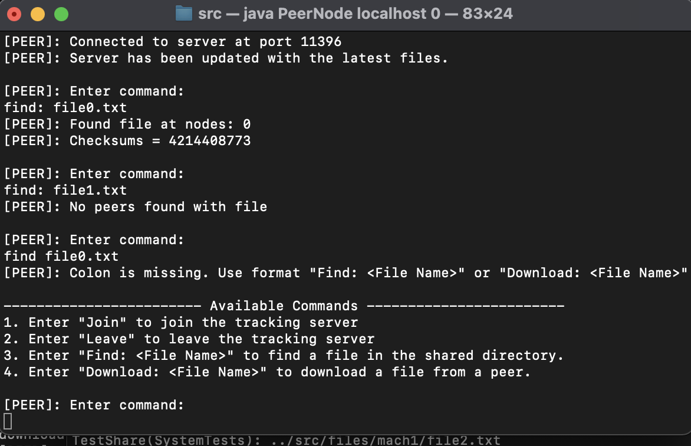

In-case multiple peers have a file, then all peer IDs are printed to the terminal:

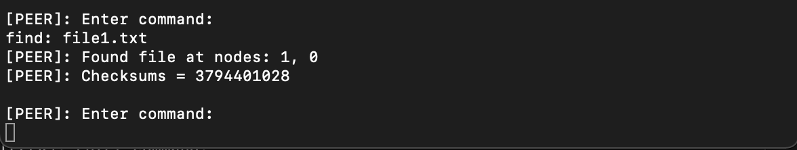

### Downloading a file

In order to download a file, a peer can enter `download: <file name>` in their respective UI terminal. Case doesn't matter for the `download` command, so you can enter `DOWNLOAD: <file name>` and that should work too.

Note: Since we have simulated file latency, it takes a maximum of 5 seconds to download a file into a peer's folder.

Example image of a successful `download` command:

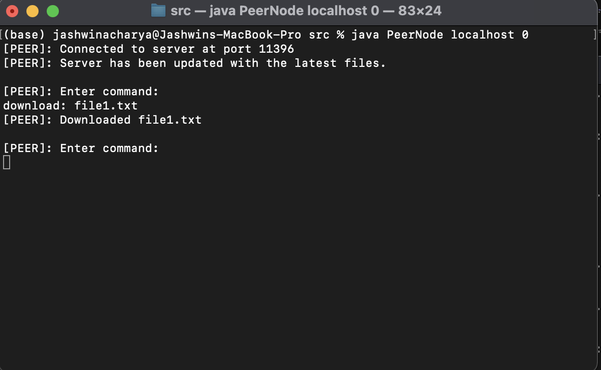

The format of the `download` function matters.

Example image of an incorrectly formatted `download` function:

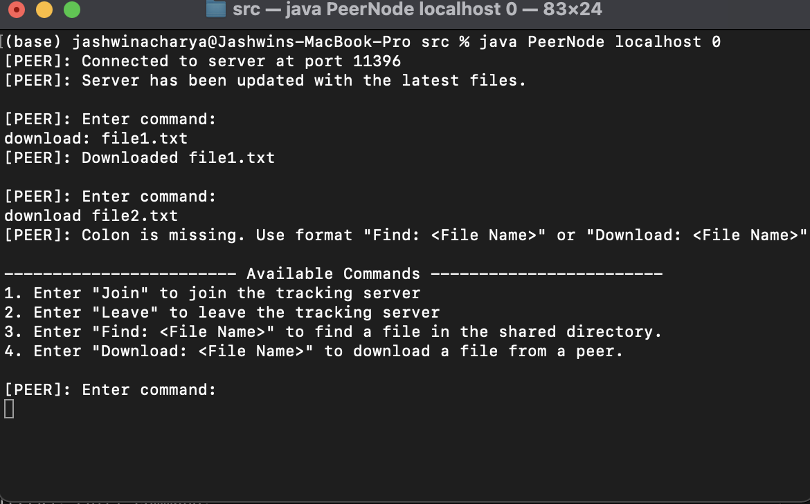

Example image of when a `download` function returns an error if the file is already present in the requesting peer's folder or when the file itself doesn't exist:

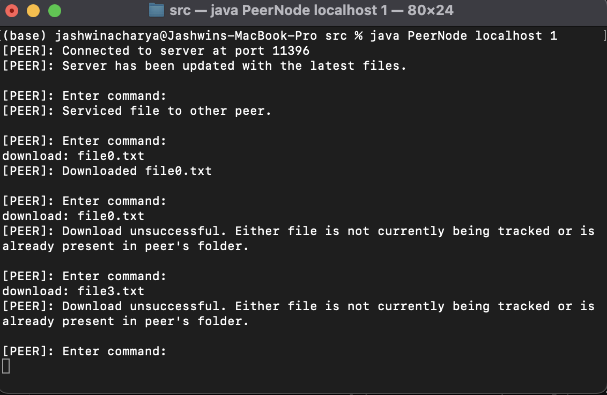

First download command succeeds since peer didn't have the file; second download command fails since file is already present in the requesting peer's folder; and third download command fails since file is not being tracked by any peer.

## Class Design Descriptions
### PeerNode
Runs the command line interface as well as implements `PeerNodeInterface` for inter-peer communication. Thus its remote methods are `Find` and `Download`, `GetLoad` and `Ping`. The handlers for command line input eventually call these methods depending on the input, or remote methods on the tracker.
On startup, this class reads its file list into a data structure, joins the server, and updates the server on its files list. It finally starts a thread that listens for command line input. When attempting to handle a download request in particular, there are mechanisms to handle corrupt content and unreachable peers.
To make a download request, it uses `Find` to determine which peers can share the file (the peer does not track state from `Find` between commands). Then, it sorts the peers based on our latency-load function and attempts downloading from peers in that order. It will re-attempt a peer if there is corruption or a `RemoteException` before moving on to the next.
The latency-load function simply multiplies the known latency with a call to `GetLoad`, which creates a "ping" index on which to sort the peers. Multiplication was chosen so that load and latency can have an equal contribution to the sorting.

### Tracker
Implements the `TrackerInterface`, from which it has the remote methods `Join`, `Leave`, `Find`, `UpdateList`, and `Ping`(unused). When a node joins, the tracker tracks its info with the `TrackedPeer` class. It also tracks reachable files with `FileInfo`. `TrackedPeer` and `FileInfo`
are used together as a two-way table, where a `FileInfo` entry has a list of `TrackedPeer`s that can service the file, and each `TrackerPeer` has a list of filenames with which it can hash into the `FileInfo` list. The tracker updates these accordingly when nodes join, leave, use `UpdateList`, and die. This information is used to service a `Find` request.
The tracker also starts and maintains the Java RMI registry for the whole system, where peers must register themselves on this registry.
### TrackedPeer

### FileInfo

### FileDownload

### ComparePeer

## Running Tests

Navigate to the test directory from root with

```
cd test
```

Compile and then run with

```
javac -cp ./../lib/junit-4.13.2.jar:. RunTests.java
java -cp ./../lib/junit-4.13.2.jar:./../lib/hamcrest-core-1.3.jar:. RunTests
````
Notes:
* Note that the tests manipulate the `files` directory, so anything done in the command line interface may be changed.
* It is assumed that files with names corresponding to their respective directories are always present, so do not delete them.
* An oddity we noted on the CSE lab machines was that tests seemed fail when run for the first time after compilation, but subsequent attempts tended to yeild successful tests. Due to process scheduling, the tests don't necessarily run in a deterministic way.
* Tests will take over a minute to complete due to simulated download latency and process scheduling.
