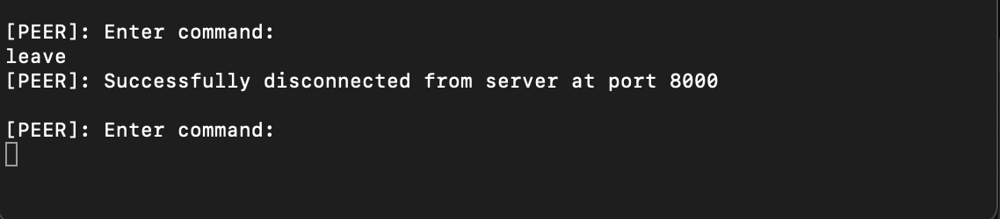

# Project 3: Simple xFS

## Authors: Jashwin Acharya (`achar061`), William Stahl (`stahl186`)

## Running Server and clients

Navigate to the src folder.

Open one terminal window in this folder and compile Tracker.java using the following command:

```
javac Tracker.java
```

You can start the server using the following command:

```
java Tracker
```

Example image below:


## Running clients and using client UI

Open a separate terminal window (apart from the server one) and compile PeerNode.java using the command:

```
javac PeerNode.java
```

In the same terminal window, use the following command:

```
java PeerNode localhost 0
```

Example image below:


The above command has the format `java PeerNode <server host name> <machID>`. You can only assign a value of 0, 1, 2, 3 or 4 to the machID. Any other machID produces an error and you will have to run the command again using a valid machID.

Example image below of using an incorrect machID:


### Joining the tracker server

The peers automatically join the tracking server when they are first launched, but in the event that the server goes down and the client wants to join again, they can simply enter `join` in the client UI.

Example image below:


A peer cannot join the tracker server if it's already part of it.

Example image below:


Every peer needs to have a different machID before attempting to join the server. Launching two peers with the same machID causes the peer that was launched at a later time to exit gracefully.

Example image below:


### Leaving the tracker server

A peer can leave the tracker server at any time by entering `leave` in their respective peer UI terminal.

Example image below:



A peer cannot leave the tracker server if it was never part of it.

Example image below:


### Finding a file

In order to find a file, a peer can enter the `find: <file name>` in their respective UI terminal. Case doesn't matter for the `find` command, so you can enter `FIND: <file name>` and that should work too.

Example image of a successful `find` command:


Attempting to find a file that doesn't belong to any peer results in an error message being printed.

Example image of an unsuccessful `find` command:


The format of the `find` function matters.

Example image of an incorrectly formatted `find` function:


In-case multiple peers have a file, then all peer IDs are printed to the terminal:


### Downloading a file

In order to download a file, a peer can enter `download: <file name>` in their respective UI terminal. Case doesn't matter for the `download` command, so you can enter `DOWNLOAD: <file name>` and that should work too.

Note: Since we have simulated file latency, it takes a maximum of 5 seconds to download a file into a peer's folder.

Example image of a successful `download` command:


The format of the `download` function matters.

Example image of an incorrectly formatted `download` function:


Example image of when a `download` function returns an error if the file is already present in the requesting peer's folder or when the file itself doesn't exist:


First download command succeeds since peer didn't have the file; second download command fails since file is already present in the requesting peer's folder; and third download command fails since file is not being tracked by any peer.

## Class Design Descriptions

### PeerNode

Runs the command line interface as well as implements `PeerNodeInterface` for inter-peer communication. Thus its remote methods are `Find` and `Download`, `GetLoad` and `Ping`. The handlers for command line input eventually call these methods depending on the input, or remote methods on the tracker.
On startup, this class reads its file list into a data structure, joins the server, and updates the server on its files list. It finally starts a thread that listens for command line input. When attempting to handle a download request in particular, there are mechanisms to handle corrupt content and unreachable peers.
To make a download request, it uses `Find` to determine which peers can share the file (the peer does not track state from `Find` between commands). Then, it sorts the peers based on our latency-load function and attempts downloading from peers in that order. It will re-attempt a peer if there is corruption or a `RemoteException` before moving on to the next peer.
The latency-load function simply multiplies the known latency with a call to `GetLoad`, which creates a "ping" index on which to sort the peers. Multiplication was chosen so that load and latency can have an equal contribution to the sorting.
We have multiple command line validation functions that validate the format of different operations such as "join", "leave", "find" and "download". We ensured that the case of the command (ex: JOIN, FIND etc) does not matter in order to keep our user experience simple and straigh-forward.
We decided on a limit of 5 peers for our system since we didn't want to overload the server with too many consecutive requests and also made the decision to have each peer have its own unique MachID which makes it easier for the tracker server to identify the right peers for exchanging files.

### Tracker

Implements the `TrackerInterface`, from which it has the remote methods `Join`, `Leave`, `Find`, `UpdateList`, and `Ping`(unused). When a node joins, the tracker tracks its info with the `TrackedPeer` class. It also tracks reachable files with `FileInfo`. `TrackedPeer` and `FileInfo` are used together as a two-way table, where a `FileInfo` entry has a list of `TrackedPeer`s that can service the file, and each `TrackerPeer` has a list of filenames with which it can hash into the `FileInfo` list. The tracker updates these accordingly when nodes join, leave, use `UpdateList`, and die. This information is used to service a `Find` request.
The tracker also starts and maintains the Java RMI registry for the whole system, where peers must register themselves on this registry. One limitation of the tracker itself creating the registry is that in the situation that the tracker is down, we can launch peers with the same machID since peers use the registry for finding out if a peer with a machID is already currently running. If the tracker is first launched and peers are launched after that, then this is not an issue and if a peer attempts to use a machID currently in the register, then our code prompts the user to run the new peer with some other machID.

### TrackedPeer

This class is useful for tracking information associated with a peer such as their machID, IP address, port number, currently tracked files, a remote reference to its object on the RMI registry, and also the "ping" which indicates the current latency and load of the peer. The class is particularly useful when different peers need to be queried for a file download and we have defined code in PeerNode.java which chooses peers based on their latency and load.

### FileInfo

This class houses information for a file such as what peers currently possess the file, what's the name of the file as well as its checksum details. This is particularly useful for the "find" function defined in Tracker.java which returns a list of peers (sorted by load) that currently possess this file in their respective directories.

### FileDownload

This class allows File Downloads to occur between clients by computing checksum values using the CRC32 hash operation and also has a function called AddNoise() that corrupts the file randomly. If a file has 5 bytes, then there exists a 5/10000 chance that it will be corrupted. In case a download operation fails due to a file being corrupted, the peer either attempts to re-download the file or tries another peer (according to code we've written in the DownloadAsClient function in PeerNode.java).

### ComparePeer

This is a class that simply compares the load and latency of peers and returns them in sorted order so that our algorithm in the DownloadAsClient() function defined in PeerNode.java can make an accurate decision on what peer to query for a file.

## Handling Fault Tolerance Scenarios

### Downloaded files can be corrupted

As we've defined earlier in the "Class Design Descriptions" section, there is a random chance of num_bytes/10000 of a file being corrupted. If a downloaded file's checksum value does not match the correct checksum value of the file (i.e., it was corrupted while the download was happening), then we attempt to re-download the file from the same peer again. If our 2nd attempt also leads to a checksum failure, then we move onto the peer who has the next smallest latency value.

### Tracking Server Crashes

Once a server crashes, all currently active peers are unable to send any requests to the server. You can still type "join", "leave" etc in their respective UI terminals, but none of these requests will be forwarded to the server as the remote server object is offline. Peer's are also unable to communicate with each other while the server is down as the server is responsible for keeping track of which peers contain certain files. Once the server is back up, you can type "join" in each of the individual peer UI terminals, thus allowing the peers to rejoin the new register created by the server and the server is also populated with each peer's respective file and folder structure since UpdateList is called everytime a peer joins the network.

### Peer Crashes

Anytime a peer goes down, you can simply relaunch the peer in a new terminal window and type "join" in the UI we have designed for peers. If the server is online, then the peer will be able to join the server and also calls the UpdateList function defined in Tracker.java using the remote server object to let the tracker know of its file and folder structure.

### Exceptional situations

#### All peers are down

In this case, no communication and exchange of files takes place among peers since they are all down.

#### Fail to find a file

In this case, the peer terminal usually prints an error message saying that the tracker is currently not tracking the requested file and the user is prompted to enter a new command.

## Running Tests

Navigate to the test directory from root with

```
cd test
```

Compile and then run with

```
javac -cp ./../lib/junit-4.13.2.jar:. RunTests.java
java -cp ./../lib/junit-4.13.2.jar:./../lib/hamcrest-core-1.3.jar:. RunTests
```

Notes:

- Note that the tests manipulate the `files` directory, so anything done in the command line interface may be changed.
- It is assumed that files with names corresponding to their respective directories are always present, so do not delete them.
- An oddity we noted on the CSE lab machines was that tests seemed fail when run for the first time after compilation, but subsequent attempts tended to yeild successful tests. Due to process scheduling, the tests don't necessarily run in a deterministic way.
- Tests will take over a minute to complete due to simulated download latency and process scheduling.
